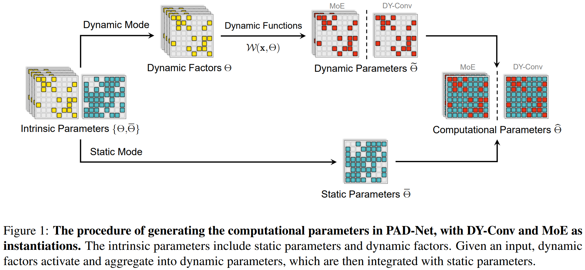

# PAD-Net: An Efficient Framework for Dynamic Networks
The source code of "PAD-Net: An Efficient Framework for Dynamic Networks
 (ACL 2023)":

 ```
PAD-Net: An Efficient Framework for Dynamic Networks
Shwai He, Liang Ding, Daize Dong, Boan Liu, Fuqiang Yu, Dacheng Tao
ACL 2023 Main Conference. 
```
<p align="center">
    
</p>
## Requirements
- torch==1.13.1
- transformers==4.17.0
- tokenizers==0.10.1
- nltk==3.5
- torchvision==0.13.1

## Usage

You should add your local path of transformers in run_glue.py. \
To train MoE on GLUE, run: 

`./dyconv/main.py` 

To train DY-Conv on ImageNet, run: 

`./moe/tasks/text-classification/run_glue_pad.py` 

## Citation

```
@inproceedings{he-etal-2023-pad,
    title = "{PAD}-Net: An Efficient Framework for Dynamic Networks",
    author = "He, Shwai  and
      Ding, Liang  and
      Dong, Daize  and
      Liu, Boan  and
      Yu, Fuqiang  and
      Tao, Dacheng",
    booktitle = "Proceedings of the 61st Annual Meeting of the Association for Computational Linguistics (Volume 1: Long Papers)",
    month = jul,
    year = "2023",
    address = "Toronto, Canada",
    publisher = "Association for Computational Linguistics",
    url = "https://aclanthology.org/2023.acl-long.803",
    doi = "10.18653/v1/2023.acl-long.803",
    pages = "14354--14366",
    abstract = "Dynamic networks, e.g., Dynamic Convolution (DY-Conv) and the Mixture of Experts (MoE), have been extensively explored as they can considerably improve the model{'}s representation power with acceptable computational cost. The common practice in implementing dynamic networks is to convert the given static layers into fully dynamic ones where all parameters are dynamic (at least within a single layer) and vary with the input. However, such a fully dynamic setting may cause redundant parameters and high deployment costs, limiting the applicability of dynamic networks to a broader range of tasks and models. The main contributions of our work are challenging the basic commonsense in dynamic networks and proposing a partially dynamic network, namely PAD-Net, to transform the redundant dynamic parameters into static ones. Also, we further design Iterative Mode Partition to partition dynamic and static parameters efficiently. Our method is comprehensively supported by large-scale experiments with two typical advanced dynamic architectures, i.e., DY-Conv and MoE, on both image classification and GLUE benchmarks. Encouragingly, we surpass the fully dynamic networks by $+0.7\%$ top-1 acc with only 30{\%} dynamic parameters for ResNet-50 and $+1.9\%$ average score in language understanding with only 50{\%} dynamic parameters for BERT. Code will be released at: \url{https://github.com/Shwai-He/PAD-Net}.",
}
```