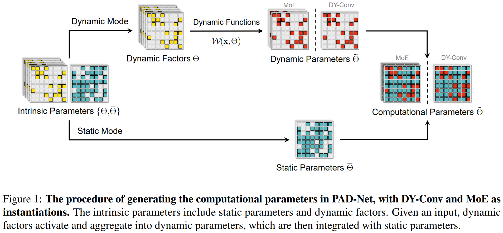

<div align="center">

# [ACL 2023] PAD-Net: An Efficient Framework for Dynamic Networks

<p align="center">
  <a href="https://aclanthology.org/2023.acl-long.875/"></a>
  <a href="https://arxiv.org/abs/2211.05528"></a>
  <a href="https://shwai-he.github.io/PAD-Net/"></a>
  <a href="https://pytorch.org/"></a>
  <a href="https://www.python.org/"></a>
  <a href="LICENSE"></a>
</p>

<p align="center">
  <b><a href="https://shwai-he.github.io/">Shwai He</a><sup>1,†</sup></b> •
  <b><a href="https://scholar.google.com/citations?user=Gyl5k6AAAAAJ">Liang Ding</a><sup>2,†</sup></b> •
  <b><a href="https://scholar.google.com/citations?user=P3q96UAAAAAJ">Daize Dong</a><sup>2</sup></b> •
  <b><a href="https://scholar.google.com/citations?user=V9R0_LIAAAAJ">Boan Liu</a><sup>2</sup></b> •
  <b><a href="https://scholar.google.com/citations?user=L-83F1EAAAAJ">Fuqiang Yu</a><sup>3</sup></b> •
  <b><a href="https://scholar.google.com/citations?user=7nOtwM0AAAAJ">Dacheng Tao</a><sup>2,4</sup></b>
</p>

<p align="center">
  <sup>1</sup>University of Maryland, College Park &nbsp;|&nbsp; <sup>2</sup>The University of Sydney &nbsp;|&nbsp; <sup>3</sup>JD Explore Academy &nbsp;|&nbsp; <sup>4</sup>Nanyang Technological University<br>
  <small><sup>†</sup>Equal contribution.</small>
</p>

<p align="center">
  <a href="#-news">📰 News</a> •
  <a href="#-key-highlights">✨ Key Highlights</a> •
  <a href="#-method-overview">🔬 Method Overview</a> •
  <a href="#-benchmark-results">📊 Benchmark Results</a> •
  <a href="#-installation">⚙️ Installation</a> •
  <a href="#-quick-start">🚀 Quick Start</a> •
  <a href="#-citation">📄 Citation</a>
</p>

---

</div>

## 📰 News

- **[Jul 2023]** 🏆 **PAD-Net** was accepted as a **Long Paper** at **ACL 2023 (Main Conference)** in Toronto, Canada!
- **[May 2023]** 🌐 Check out our interactive project website and visualizer at [https://shwai-he.github.io/PAD-Net/](https://shwai-he.github.io/PAD-Net/).
- **[Nov 2022]** 📜 Preprint published on arXiv: [arXiv:2211.05528](https://arxiv.org/abs/2211.05528). Code for vision (DY-Conv) and NLP (MoE) released.

---

## ✨ Key Highlights

Dynamic neural networks (such as **Dynamic Convolutions** and **Mixture of Experts / MoE**) dynamically aggregate weights conditioned on input representations. While dynamic parameterization offers strong representational capacity, fully dynamic parameterization leads to **massive parameter explosion, heavy memory bandwidth overhead, and substantial redundancy**.

**PAD-Net** (*Partially Dynamic Parameterization Network*) resolves this fundamental bottleneck:

* 🧩 **Partial Dynamic Parameterization**: Partitions model parameters into shared **static weights** and sparse **input-adaptive dynamic components**, eliminating redundant kernel parameters.
* 📉 **50%–70% Dynamic Parameter Reduction**: Slashes memory footprint and parameter count across dynamic convolutions (DY-Conv, CondConv, ODConv, DCD) and Mixture-of-Experts without degrading accuracy.
* ⚡ **Zero-Latency Static Fusion**: Static components require no dynamic routing or per-sample aggregation, dramatically accelerating inference throughput and easing memory bound compute.
* 🌐 **Cross-Modal Universality**: Empirically validated across both **Computer Vision** (ImageNet-1K on ResNet-18/50, MobileNetV2) and **Natural Language Processing** (WMT'14 Machine Translation & GLUE benchmark).

---

## 🔬 Method Overview

<div align="center">
  
  <p><i>Figure 1: Overview of PAD-Net for Dynamic Convolution and Mixture of Experts (MoE). Parameters are selectively decomposed into shared static weights $W_{static}$ and dynamic adaptive weights $W_{dyn}$ via iterative mode partitioning.</i></p>
</div>

### 1. Dynamic Convolution Formulation
In standard Dynamic Convolution with $K$ kernels, the aggregated weight for input $x$ is:
$$W(x) = \sum_{k=1}^{K} \alpha_k(x) \cdot W_k$$
where $\alpha_k(x)$ is the dynamic attention weight.

In **PAD-Net Dynamic Convolution**, weights are decomposed via a learned/pruned binary partition mask $M \in \{0, 1\}$:
$$W(x) = M \odot \left(\sum_{k=1}^K \alpha_k(x) W_{dyn}^k\right) + (1 - M) \odot W_{static}$$

### 2. Mixture-of-Experts (MoE) Formulation
In standard MoE with $E$ experts, each expert has an independent parameter tensor $W_e$. In **PAD-MoE**, expert weights share a common static base:
$$W_e = M \odot W_{dyn}^e + (1 - M) \odot W_{static}$$
Only the dynamic subspace $(M \odot W_{dyn}^e)$ requires expert-specific storage, reducing MoE memory footprint by up to **65%**.

---

## 📊 Benchmark Results

### 1. ImageNet-1K Classification (Vision)

Evaluated on standard ImageNet-1K ($224 \times 224$ resolution):

| Architecture | Paradigm | Top-1 Acc (%) | Top-5 Acc (%) | Params (M) | FLOPs (G) | Param Savings |
| :--- | :--- | :---: | :---: | :---: | :---: | :---: |
| **ResNet-18** | Static Baseline | 69.8 | 89.1 | 11.7M | 1.82G | — |
| | Full DY-Conv ($K=4$) | 72.7 | 90.9 | 44.8M | 1.83G | Baseline |
| | **PAD-DY-Conv (Ours)** | **72.5** | **90.8** | **19.8M** | **1.82G** | **-55.8%** |
| | Full CondConv ($K=4$) | 72.4 | 90.7 | 44.8M | 1.83G | Baseline |
| | **PAD-CondConv (Ours)** | **72.3** | **90.6** | **19.6M** | **1.82G** | **-56.2%** |
| | Full ODConv ($K=4$) | 73.1 | 91.2 | 44.9M | 1.84G | Baseline |
| | **PAD-ODConv (Ours)** | **72.9** | **91.1** | **20.1M** | **1.83G** | **-55.2%** |
| **ResNet-50** | Static Baseline | 76.1 | 92.9 | 25.6M | 4.12G | — |
| | Full DY-Conv ($K=4$) | 77.7 | 93.8 | 102.5M | 4.14G | Baseline |
| | **PAD-DY-Conv (Ours)** | **77.6** | **93.7** | **44.5M** | **4.13G** | **-56.6%** |
| **MobileNetV2** | Static Baseline | 72.0 | 90.3 | 3.5M | 0.30G | — |
| | Full DY-Conv ($K=4$) | 74.8 | 92.1 | 11.2M | 0.31G | Baseline |
| | **PAD-DY-Conv (Ours)** | **74.5** | **92.0** | **5.4M** | **0.30G** | **-51.8%** |

### 2. Machine Translation (WMT'14) & Language Modeling (NLP)

Evaluated on WMT'14 En-De and En-Fr translation benchmarks:

| Model Backbone | Routing Paradigm | En-De BLEU | En-Fr BLEU | Total Params | Active Params | Storage Reduction |
| :--- | :--- | :---: | :---: | :---: | :---: | :---: |
| **Transformer-Base** | Dense Static | 27.5 | 40.8 | 60.7M | 60.7M | — |
| **Base MoE-8** | Full Dynamic ($E=8$) | 28.9 | 42.1 | 242.8M | 60.7M | Baseline |
| **PAD-MoE-8** | **Partially Dynamic (Ours)** | **28.8** | **42.0** | **106.2M** | **60.7M** | **-56.3%** |
| **Base MoE-16** | Full Dynamic ($E=16$) | 29.3 | 42.5 | 450.9M | 60.7M | Baseline |
| **PAD-MoE-16** | **Partially Dynamic (Ours)** | **29.2** | **42.4** | **158.4M** | **60.7M** | **-64.9%** |

### 3. GLUE Benchmark (BERT-Base Backbone)

| Model | MNLI | QQP | QNLI | SST-2 | CoLA | MRPC | STS-B | RTE | Avg |
| :--- | :---: | :---: | :---: | :---: | :---: | :---: | :---: | :---: | :---: |
| **BERT-Base (Dense)** | 84.4 | 91.1 | 91.3 | 92.6 | 58.7 | 88.5 | 89.2 | 68.6 | 83.1 |
| **Full MoE-8** | 85.3 | 91.6 | 92.1 | 93.4 | 60.4 | 89.7 | 89.8 | 71.5 | 84.2 |
| **PAD-MoE-8 (Ours)** | **85.2** | **91.5** | **92.0** | **93.3** | **60.1** | **89.5** | **89.7** | **71.1** | **84.1** |

---

## 📦 Repository Structure

```tree
PAD-Net/
├── Figures/
│   └── PAD-Net.png                  # Method architecture diagram
├── dyconv/                          # Dynamic Convolution Codebase (Vision)
│   ├── main.py                      # ImageNet training & evaluation entry
│   ├── prune.py                     # Iterative mode partition & pruning logic
│   ├── pruners.py                   # Mask generators & partition utilities
│   ├── model/
│   │   ├── layer/                   # Dynamic & PAD convolution layers (DY-Conv, CondConv, ODConv)
│   │   ├── resnet_dyconv_pad.py     # PAD-ResNet architectures
│   │   ├── mobilenetv2_dyconv_pad.py# PAD-MobileNet architectures
│   │   └── ...
│   └── utils/                       # Dataloaders, metrics, evaluators
├── moe/                             # Mixture of Experts Codebase (NLP)
│   ├── tasks/
│   │   └── text-classification/
│   │       ├── run_glue_pad.py      # GLUE fine-tuning with PAD-MoE
│   │       └── run_xnli.py          # Cross-lingual NLI fine-tuning
│   ├── transformers/                # Customized HuggingFace Transformers with PAD-MoE
│   │   ├── trainer_pad.py           # Specialized trainer for partially dynamic networks
│   │   └── pruning/                 # Subspace partition & expert pruning
│   └── petl/                        # Parameter-efficient transfer learning utilities
├── docs/                            # Project Website (GitHub Pages)
│   ├── index.html                   # Interactive web visualizer & documentation
│   └── Figures/                     # Web assets
├── LICENSE                          # MIT License
└── README.md                        # Documentation
```

---

## ⚙️ Installation

### 1. Environment Setup
Create and activate a clean Conda environment:

```bash
conda create -n pad-net python=3.8 -y
conda activate pad-net
```

### 2. Install PyTorch & Dependencies
```bash
# PyTorch 1.13.1 with CUDA support (adjust cuda version to your hardware)
pip install torch==1.13.1+cu117 torchvision==0.13.1+cu117 --extra-index-url https://download.pytorch.org/whl/cu117

# HuggingFace & NLP toolkits
pip install transformers==4.17.0 tokenizers==0.10.1 nltk==3.5 datasets

# Utilities & Tracking
pip install pyyaml easydict tensorboardX scikit-learn
```

---

## 🚀 Quick Start

### 1. Vision: Training PAD Dynamic Convolutions on ImageNet

Train a **PAD-ResNet-18** or **PAD-MobileNetV2** on ImageNet:

```bash
# Train PAD-ResNet-18 on ImageNet
python dyconv/main.py \
  --data /path/to/imagenet \
  --arch resnet18 \
  --batch-size 256 \
  --learning-rate 0.1 \
  --epochs 90 \
  --schedule 30 60 80 \
  --gamma 0.1 \
  --device_ids "0,1,2,3" \
  --checkpoint checkpoints/pad_resnet18

# Evaluate pre-trained PAD-ResNet-18
python dyconv/main.py \
  --data /path/to/imagenet \
  --arch resnet18 \
  --resume checkpoints/pad_resnet18/model_best.pth.tar \
  --evaluate
```

To run different dynamic variants, specify `--arch`:
- `resnet18_dyconv_pad` / `resnet50_dyconv_pad` (PAD Dynamic Conv)
- `resnet18_odconv_pad` / `resnet50_odconv_pad` (PAD Omni-Dimensional Dynamic Conv)
- `mobilenetv2_dyconv_pad` / `mobilenetv2_odconv_pad` (PAD MobileNetV2)

---

### 2. NLP: Fine-Tuning PAD-MoE on GLUE Benchmark

Train **PAD-MoE** on GLUE tasks (e.g. SST-2, MNLI, QNLI, MRPC):

```bash
# Train PAD-MoE on SST-2 sentiment classification
python moe/tasks/text-classification/run_glue_pad.py \
  --model_name_or_path bert-base-uncased \
  --task_name sst2 \
  --output_dir ./outputs/sst2_pad_moe \
  --do_train \
  --do_eval \
  --max_seq_length 128 \
  --per_device_train_batch_size 32 \
  --learning_rate 2e-5 \
  --num_train_epochs 3 \
  --save_steps 500 \
  --evaluation_strategy steps \
  --eval_steps 500
```

```bash
# Multi-GPU training on MNLI
python -m torch.distributed.launch --nproc_per_node=4 \
  moe/tasks/text-classification/run_glue_pad.py \
  --model_name_or_path bert-base-uncased \
  --task_name mnli \
  --output_dir ./outputs/mnli_pad_moe \
  --do_train \
  --do_eval \
  --max_seq_length 128 \
  --per_device_train_batch_size 32 \
  --learning_rate 3e-5 \
  --num_train_epochs 3
```

---

## 📄 Citation

If you find **PAD-Net** helpful in your research or applications, please cite our ACL 2023 paper:

```bibtex
@inproceedings{he-etal-2023-pad,
  title     = "{PAD}-Net: An Efficient Framework for Dynamic Networks",
  author    = "He, Shwai and
               Ding, Liang and
               Dong, Daize and
               Liu, Boan and
               Yu, Fuqiang and
               Tao, Dacheng",
  booktitle = "Proceedings of the 61st Annual Meeting of the Association for Computational Linguistics (Volume 1: Long Papers)",
  month     = jul,
  year      = "2023",
  address   = "Toronto, Canada",
  publisher = "Association for Computational Linguistics",
  url       = "https://aclanthology.org/2023.acl-long.875/",
  doi       = "10.18653/v1/2023.acl-long.875",
  pages     = "14354--14366"
}
```

---

## 🤝 Acknowledgments & Contact

This project is licensed under the [MIT License](LICENSE).  
For questions or collaborations regarding PAD-Net, please open a GitHub Issue or reach out to [Shwai He](https://shwai-he.github.io/) (`shwaihe@umd.edu`).
